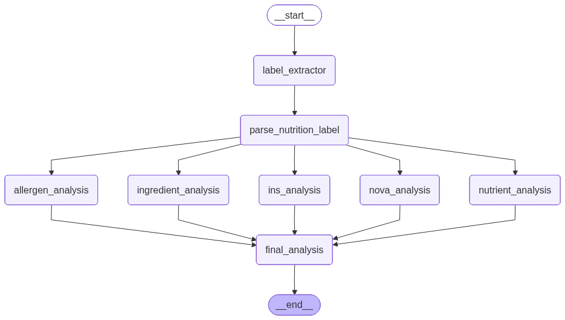

# foodify.ai

foodify.ai is a nutrition-label intelligence workflow that turns packaged-food label images or raw OCR text into a structured food product report. It extracts label text, parses nutrients and ingredients, evaluates additives, allergens, processing level, and nutrient quality, then combines those signals into a practical consumption recommendation.



## What It Does

- Extracts text from uploaded label images with Mistral vision OCR.
- Parses nutrition tables, serving details, ingredients, and INS additive codes.
- Runs parallel LangGraph analysis nodes for:
  - allergen detection
  - ingredient quality
  - INS additive safety
  - NOVA processing classification
  - nutrient scoring
- Synthesizes all findings into a final product report with rating, warnings, positives, concerns, suitability, and score breakdown.
- Provides both a Streamlit UI and a CLI workflow runner.

## Project Structure

```text
.
├── app.py                         # Streamlit application
├── main.py                        # LangGraph workflow and CLI entry point
├── helper.py                      # Shared state types, LLM setup, nutrient scales, INS lookup
├── foodify.workflow.png           # Workflow graph image
├── nodes/
│   ├── extract_text_from_image.py # Mistral OCR
│   ├── parse_nutrition_label.py   # OCR text to structured label data
│   ├── allergen_analysis.py
│   ├── ingredient_analysis.py
│   ├── ins_analysis.py
│   ├── nova_analysis.py
│   ├── nutrient_analysis.py
│   └── final_analysis.py
└── dataset/
    ├── INS_agent_dataset.jsonl
    ├── INS_synonyms.json
    └── INS_function_schema.json
```

## Requirements

- Python 3.13 or newer
- `uv` for dependency management
- API keys for the model providers used by the workflow

## Setup

Install dependencies:

```bash
uv sync
```

Create your local environment file:

```bash
cp .env.example .env
```

On Windows PowerShell:

```powershell
Copy-Item .env.example .env
```

Fill in the values in `.env`:

```env
OPENROUTER_API_KEY=
HF_API_KEY=
MISTRAL_API_KEY=

LANGSMITH_TRACING=false
LANGSMITH_API_KEY=
LANGSMITH_PROJECT=foodify-ai
```

`OPENROUTER_API_KEY` is required for the LLM analysis nodes. `MISTRAL_API_KEY` is required when analyzing label images because OCR uses Mistral's vision API. LangSmith settings are optional.

## Run The Streamlit App

```bash
uv run streamlit run app.py
```

Open the Streamlit URL, upload a clear nutrition-label image, and select **Analyze label**.

Supported upload formats:

- PNG
- JPG / JPEG
- WEBP
- BMP

## Run The CLI Workflow

Run with the built-in sample OCR text:

```bash
uv run python main.py
```

Run with an image:

```bash
uv run python main.py path/to/label.png
```

Run with a text file:

```bash
uv run python main.py path/to/label.txt
```

Run with direct raw label text:

```bash
uv run python main.py --text "Ingredients: ... Nutritional Information ..."
```

The CLI streams completed graph nodes and prints the final report as JSON.

## Workflow

The graph is defined in `main.py`:

1. `label_extractor` receives raw text or extracts OCR text from an image.
2. `parse_nutrition_label` converts raw text into structured label data.
3. Five analysis nodes run from the parsed label:
   - `allergen_analysis`
   - `ingredient_analysis`
   - `ins_analysis`
   - `nova_analysis`
   - `nutrient_analysis`
4. `final_analysis` synthesizes all node outputs into one report.

The same flow is shown in `foodify.workflow.png`.

## Data

The INS additive lookup is local and backed by the files in `dataset/`. `helper.py` loads the JSONL additive dataset and synonym map, then `nodes/ins_analysis.py` uses that data to classify additive safety and approval status.

## Notes

foodify.ai is an analysis assistant, not medical advice. Label OCR and model outputs can be imperfect, so review important results before using them for dietary, medical, or regulatory decisions.
